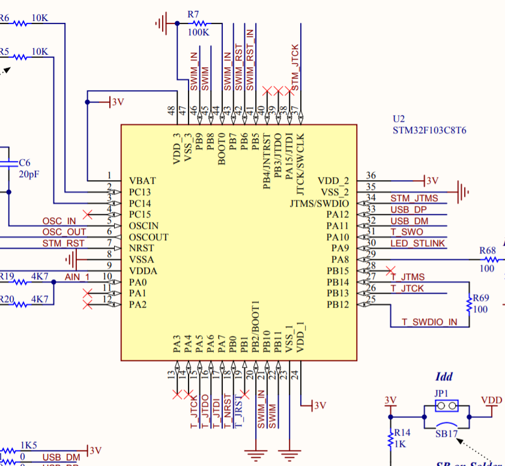
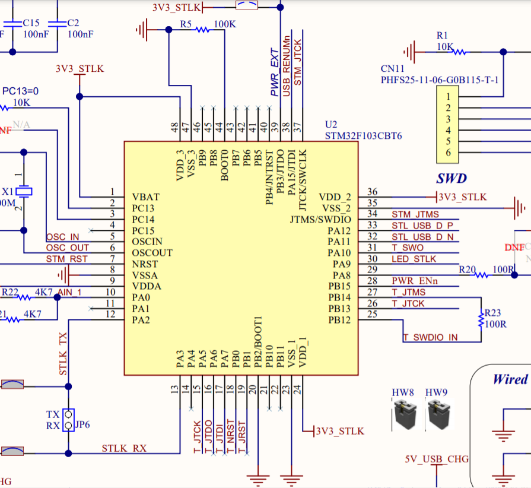

Upgrading ST-LINK/V2 clone to ST-LINK/V2-1
==========================================

by cyanic ([Twitter](https://twitter.com/GMMan_BZFlag)), 2021/01/17

You've got a ST-Link V2 clone, but you've been eyeing some of the features of
a ST-Link V2.1: SWO, virtual COM port, and drag-and-drop programming, more bus
power. In this guide, we explore the layout of the the ST-Link firmware and
how you can upgrade it to ST-Link V2.1

For the upgrade procedure in this guide, you will need another debug probe for
connecting to the ST-Link you want to upgrade. Additionally, I assume you have
a genuine ST-Link V2.1 to dump an image from. While it is possible to upgrade
without an image from a genuine ST-Link, and the instructions here should be
sufficient for you to know where to place things, it is up to you to find the
files in a usable form. You will also need a UART adapter to receive dumped
firmware.

A note about flash size
-----------------------

The most feature-filled version of ST-Link v2.1 firmware takes up more than
the 64KB available on STM32F103C8T6. However, a genuine STM32F103C8T6 uses the
same die as STM32F103CBT6, which has 128KB of flash, but only reports 64KB,
while the extra flash is fully functional. If you can verify that you have a
genuine STM32F103C8T6 or STM32F103CBT6, you can install said firmware, but
otherwise you will have to settle for a smaller firmware.

Getting started: backups and dumps
----------------------------------

To get started, we'll dump the firmware from both the ST-Link you're upgrading
and the ST-Link V2.1 you already have. The original firmware from the ST-Link
you're upgrading contains the anti-clone bytes that we'll need to restore later,
and an image of a ST-Link V2.1 is needed for the bootloader and decrypted copy
of the firmware.

First, download and build the ST-Link firmware dumper from [here](https://github.com/GMMan/st-link-hack).
Checkout the `stlink-v2` branch, and build `host_app` (a .NET Core app) and
`payload` (build with `arm-none-eabi-gcc`, download from [Arm](https://developer.arm.com/tools-and-software/open-source-software/developer-tools/gnu-toolchain/gnu-rm/downloads)).
Once you've built those, connect the UART adapter to the ST-Link clone, with
ground to GND and RX to RST. Plug in the ST-Link, and run the host app with the
stack address `0x200007d4`, and you should get your dump.

Next, update your genuine ST-Link V2.1 to the desired version of the ST-Link
firmware using the [firmware upgrade utility](https://www.st.com/en/development-tools/stsw-link007.html).
Once you have done that, checkout the `master` branch of the firmware dumper,
and rebuild `host_app` and `payload`. Connect your UART adapter to the ST-Link
V2.1, RX on the UART adapter to TX on the ST-Link, and ground to any of the
available ground pins. Run the host app with stack address `0x20001c9c`, and
you should receive a dump of the V2.1 bootloader and firmware.

Firmware layout
---------------

Before we continue with the upgrade, first I would like to tell you about how
the firmware is laid out in flash. The firmware is laid out as such:

- `0x08000000` Bootloader: this is used for USB firmware upgrades. On V2 it
  waits for the host to explicitly boot into the firmware, while on V2.1 it
  boots directly into firmware unless there is no firmware installed, or
  a software reset was previously issued.
- `0x08003c00` Configuration area: this contains the anti-clone tag, produuct
  type, and configuration values, plus the current firmware version at the end.
- `0x08004000` Firmware: this is the actual application that serves the various
  functions of the device.
- `0x0801f800` Backup configuration area: same as above, but slightly different
  product type. Gets copied to the regular configuration area under certain
  conditions that I have not thoroughly investigated yet. It is only present
  on 128KB chips. Since it gets copied to the normal area, it is the same size
  as the normal area.
- End of flash - 16 bytes - Firmware installed tag: this tag marks that firmware
  is installed.

### Bootloader

The bootloader handles the DFU command set for updating ST-Link over USB, and
also boots the application. Additionally, the readout protection is enabled
here. The bootloader does not ship with any ST-Link upgrades, so to obtain it
you must dump a copy from an existing ST-Link. For ST-Link/V2-1 and later, at
`0x100` from the beginning of the bootloader is a tag that identifies it as a
valid bootloader, and includes three fields: the magic value `0x47a53c15`, the
hardware version number, and a pointer to the entry point for rebooting to
bootloader.

### Configuration area

This area contains values at the following relative offsets:
- `0x0000`: a 16-byte anti-clone tag which is the firmware download
  transit key reencrypted with a different key. The ST-Link will return errors
  when trying to debug if the anti-clone tag does not validate.
- `0x0020`: one character indicating the device type. It can be one of the
  following values:
  - 'A': STM32 Debugger+Audio
  - 'B': STM32 Debug+VCP / STM32 Debug+Mass storage+VCP
  - 'C': STM32 Debugger+Audio (firmware)
  - 'D': STM32 Debug+VCP / STM32 Debug+Mass storage+VCP (firmware)
  - 'E': STM32 Debug+Mass storage+VCP
  - 'F': STM8/STM32 Debug+2VCP+Bridge / STM8/STM32 Debug+Mass storage+VCP+Bridge
  - 'G': STM8 Debug+Mass storage+VCP
  - 'J': STM32 Debugger
  - 'L': STM32 Debugger (firmware)
  - 'M': STM8/STM32 Debugger
  - 'O': STM8/STM32 Debugger (firmware)
  - 'S': STM8 Debugger
  - 'U': STM8 Debugger (firmware)
  - 0xff: Undefined

  This determines what firmware the upgrader tries to flash when upgrading.
- `0x0040`: device configuration. This section contains some options, usually
  settable with the all-platforms version of the upgrader via the command line.
  We will look at setting a few options available to ST-Link V2.1 later. The
  format of each option is a character indicating that the option is set,
  followed by the value of the option.
- `0x03f0`: version area. For ST-Link V2.1 and earlier, the last 2 bytes of
  this area is used to store the version. In big endian order, the structure is
  as follows:
  - 4 bits: major version, is `2` for ST-Link V2 and V2.1.
  - 6 bits: JTAG version
  - 6 bits: Other version. On V2 it is SWIM, while on V2.1 it is the virtual
    COM port/mass storage version.
  
  On V3 this area uses the full 16 bytes, but since we're not upgrading to V3
  we won't worry about that.

### Firmware

This area contains the firmware. There's not much to say about it, other than
it's built to use `0x08004000` as the ROM base address.

### Backup configuration area

This contains the same content as the main configuration area, other than the
device type is using the code marked as "(firmware)" in the above table. It
appears this is used to update the main configuration area in certain
cicumstances, but I have not really explored when it is triggered.

### Firmware installed tag

This tag is present at the end of flash and indicates that firmware is
installed, so the V2.1 bootloader can automatically boot to the firmware
instead of waiting for the host to trigger the boot. The tag consists of the
first 12 bytes of the anti-clone tag, then the value (in little-endian)
`0xa50027de`.

Preparing new firmware
----------------------

Here we are using the dumped firmware from the genuine ST-Link V2.1 as a base.
The bootloader, firmware, and basic configurations are set for you, and we just
need to update the anti-clone tag and maybe set some new configuration. For
clones with STM32F103C8T6, the bootloader needs to be patched so it can find
the firmware installed tag correctly.

### Anti-clone tag

Copy the 16 bytes at `0x3c00` (relative to the beginning of the dump) from your
clone's dump to the genuine dump at `0x3c00` and `0x1f800`. Also copy the first
12 bytes of the dump to `0x1fff0` (this is not strictly required, but good if
you want to be consistent).

### Device configuration

There are three configurable options for ST-Link V2.1 (offsets relative to
the start of the device configuration area):
- USB bus current request: this allows you to request up to 500mA of current
  from the host. Set char at `0x00` to `P` and the next byte to the current you
  want to request divided by 2.
- USB mass storage volume name: this is the drive name that shows up on the
  mass storage device when you plug in the ST-Link. You have 11 characters
  available. To use, set char at `0x02` to `V` and use the following 11
  characters for the volume name. If you do not use all 11 characters, pad out
  the rest of the space with the whitespace character. Note that the upgrader
  app restricts the names you can specify for this option, so if you plan on
  using any names that start with `NUCLEO`, `EVA`, `DIS`, `NOD`, or `STLINK`,
  you will have to set it directly in the configuration area rather than
  asking the upgrader to change it for you. If you do not specify a volume
  name, `NUCLEO` may be used as the default.
- Board ID: this is for the Mbed shortcut. If you want to use the shortcut,
  set char at `0x0f` to `B` and use the following for characters to enter the
  board ID. ST-Link V2.1 is also used on Azure IoT Dev Kit. If you want a
  shortcut for that instead, set the board ID to `MSLK`.

Note the byte at `0x0e` is reserved and not used. After you have set up your
options, remember to copy it to the backup configuration area.

### Bootloader patching for STM32F103C8T6

Bootloader patching for STM32F103C8T6 is required because the firmware installed
tag will be read from the middle of firmware code otherwise. If you are only
going to use a firmware that will fit within 64KB, you can skip the patching,
move the firmware installed tag to the end of the 64KB space, and truncate the
dump.

There are two sets of patches for the 64KB chip. The first patch will update
where the bootloader looks for the firmware installed tag, and the second patch
will enable a hidden feature that will allow you to use the official upgrader
to upgrade firmware that is designed for 128KB chips.

For the first patch, modify the code at `0x2a58` (relative to start of dump)
from

```
        08002a58 3a  48           ldr        r0,[DAT_08002b44 ]                               = 1FFFF7E0h
        08002a5a 3b  49           ldr        r1,[UINT_08002b48 ]                              = A50027D3h
        08002a5c 00  88           ldrh       r0,[r0,#0x0 ]=>DAT_1ffff7e0
        08002a5e 80  02           lsl        r0,r0,#0xa
        08002a60 50  f8  04  0c    ldr.w      r0,[r0,#-0x4 ]
```

to

```
        08002a58 00  20           mov        r0,#0x0
        08002a5a 3b  49           ldr        r1,[UINT_08002b48 ]                              = A50027D3h
        08002a5c c0  f6  02  00    movt       r0,#0x802
        08002a60 50  f8  04  0c    ldr.w      r0,[r0,#-0x4 ]=>DAT_0801fffc
```

This will make the code read at the fixed address `0x0801fffc` (end of 128KB)
instead of from where the chip itself indicates is the end of the flash.

For the second patch, it is a bit more involved. There are three places to
patch. First, change the word at `0x0104` from `21000000` to `21000001`. Next,
add a shim at `0x3250`:

```
                             LAB_08003250                                    XREF[1]:     usb_handle_dfu:08001720 (j)   
        08003250 40  f2  01  00    movw       r0,#0x1
        08003254 c2  f2  00  10    movt       r0,#0x2100
        08003258 fe  f7  64  ba    b.w        LAB_08001724
```

and change the code at `0x1720` from

```
        08001720 4f  f0  04  50    mov.w      r0,#0x21000000
```

to

```
        08001720 01  f0  96  bd    b.w        LAB_08003250
```

These changes update a hardware version number used by the upgrader app and
firmware to enable a hidden feature that treats the chip as 128KB and also
enables manual reenumeration in the firmware so it comes back properly after
upgrading firmware instead of you having to replug the ST-Link. Unfortunately,
the bootloader itself does not modify its reenumeration logic accordingly, so
rebooting to bootloader in the upgrader app is still a bit fiddly.

### Optional: prevent readout protection enabling

This patch can be used on any chip to prevent the bootloader from enabling
readout protection and making it annoying to update configuration and debugging
the ST-Link itself. At `0x2a44`, change

```
        08002a44 fe  f7  f8  ff    bl         flash_program_rdp                                void flash_program_rdp(bool prot
```

to

```
        08002a44 00  bf           nop
        08002a46 00  bf           nop
```

This will prevent the RDP option byte from being written at boot.

You have now set up the firmware image for flashing to the ST-Link clone.

Flashing the clone
------------------

You can use your favorite tools to flash the clone, whether that is using
OpenOCD, STM32CubeProgrammer, or STM32 ST-LINK Utility.

First, connect your probe to the clone. Some of them have test pads, others
spaces for pin headers, and some don't have any debug headers. Mine happens to
have test pads.


If you cannot find your debug port, you can look at [the schematic for ST-Link
V2 (page 2)](https://www.st.com/resource/en/schematic_pack/mb997-f407vgt6-c01_schematic.pdf)
and trace `STM_JTMS` (pin 34) and `STM_JTCK` (pin 37) to see if there is a
connection point available.



After you have connected the clone to your debug probe, connect the probe to
your computer and open up the software for it. In this example I'm using
OpenOCD with a ST-Link v2.1. Run OpenOCD as such:

```bash
openocd -f interface/stlink.cfg -c "transport select hla_swd" -f target/stm32f1x.cfg
```

If you have a STM32F103C8T6 and you want to use firmware designed for a 128KB
chip, add to the `-c` option the following: `; set FLASH_SIZE 0x20000`. This
overrides the flash size in OpenOCD to 128KB so it will not stop flashing early.

Next, telnet into OpenOCD (typically `localhost:4444`), and enter the following:

```
stm32f1x unlock 0
program firmware.bin verify 0x08000000
```

Replace `firmware.bin` with the name of the image you want to flash to the
clone. This will unlock the chip (and erasing it in the process), then program
in the new firmware. If the procedure was successful, you can issue `reset
run` to restart the chip and run the new firmware. If you are using a firmware
with mass storage device support, you should see a new USB drive show up with
the volume label you've chosen. You can now disconnect the probe.

Hardware modifications
----------------------

To make full use of your newly upgraded ST-Link, there are a few hardware
modifications you may want to make.

The first is reenabling the reset line. ST-Link V2 with SWIM has a line for
SWIM reset, but ST-Link V2.1 does not use the same pin for SWD reset. Instead,
it is on pin 18. If your clone does not already tie pin 41/42 with pin 18,
you will need to do this yourself for reset to work.


Since ST-Link V2.1 doesn't have SWIM functionality anymore, the SWIM pin is no
longer in use, and can be tied to something else. A good candidate for this is
SWO, which is on pin 31.

The other major feature of ST-Link V2.1 is the virtual COM port. The only
remaining pins on a typical 10-pin ST-Link clone are 5V and 3.3V pins, but
since there are two of each, you can cut one set and use them for TX and RX.
ST-Link's TX is on pin 12 of the microcontroller and RX is on pin 13. See the
[ST-Link V2.1 schematic (page 7)](https://www.st.com/resource/en/schematic_pack/mb1360-g070rb-c01_schematic.pdf)
for pinout.



Using STLinkUpgrade
-------------------

The STLinkUpgrade application has a few command line options that allow you to
customize the configuration options for your ST-Link. Use the
Java application in the `AllPlatforms` directory.

Command line options:
- `-update`: Updates the ST-Link if necessary.
- `-force_prog`: Forces writing new firmware (of the same type).
- `-checkVer`: Shows the ST-Link version.
- `-checkDfuVer`: Shows the bootloader version. ST-Link V2 is DFU v1, ST-Link
  V2.1 (and potentially variants) is DFU v2, ST-Link V3 is DFU v3.
- `-volume`: Sets mass storage device volume name, subject to previously
  mentioned restrictions.
- `-deleteV`: Removes mass storage device volume name.
- `-board`: Sets Mbed board ID.
- `-deleteB`: Removes board ID.

The upgrader is capable of writing a new firmware to a ST-Link that only has
the bootloader installed, meaning the firmware and configuration area can be
blank. Specify which firmware variant you want to install on the command line
and the program will perform a full setup of it, including writing anti-clone
tag, type, configuration, and firmware installed tag. Select only one:

- `-jtag`: JTAG only
- `-swim`: SWIM only
- `-jtag_swim`: JTAG and SWIM
- `-msvcp`: JTAG with mass storage device and virtual COM port
- `-audio`: JTAG with audio

Note when you are using the upgrader with a ST-Link clone that does not have
hardware for USB re-enumeration, you will generally have to click "Open in
update mode" three times for it to detect the ST-Link. First time will reboot
the ST-Link in bootloader mode, but will time out because enumeration takes
longer than a second. The second click is still referencing the old device,
so will give you an error, and the program will refresh its devices list. The
third click will finally have the program communicate with the bootloader.
